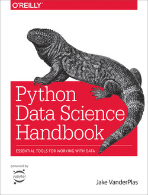
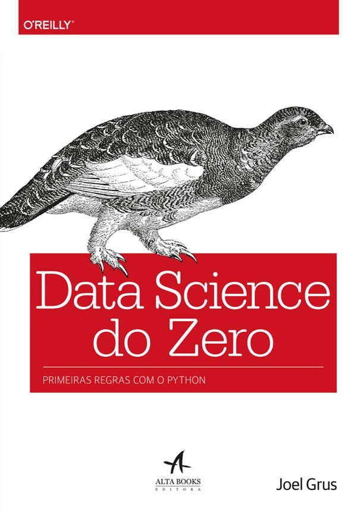
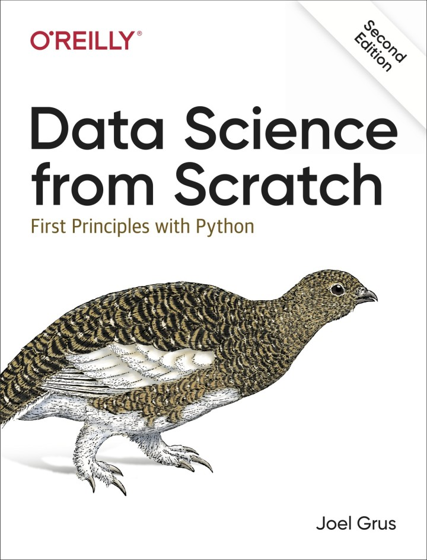

# Ciência de Dados

Prof. Eduardo Ono

 

## Descrição

Este repositório visa contemplar o conteúdo equivalente ao do curso [Professional Certificate in Data Science](https://online-learning.harvard.edu/series/professional-certificate-data-science), disponibilizado pela Universidade de Harvard, além de outras disciplinas correlatas. A principal diferença é que o curso de Harvard adota como principal ferramenta a linguagem R, ao passo que o presente curso faz uso da lingugam Python.

| Thumb | Descrição |
| :-: | --- |
|  | [Caio Dallaqua] [__CIÊNCIA DE DADOS \| O novo curso da USP__](https://www.youtube.com/watch?v=WvQHQHIyfsI)   (11:51, YouTube, Ago/2020)

 

## Conteúdo ("Blocos" de Conhecimento)

| Matemática para Ciência de Dados |
| --- |
| [Matemática Discreta](./matematica-discreta)
| Cálculo I, II e III
| Álgebra Linear
| Equações Diferenciais

| Estatística |
| --- |
| Teoria das Probabilidades
| Inferência Estatística

| Computação |
| --- |
| [Introdução à Programação]
| [Estrutura de Dados]
| [Programação Orientada a Objetos]
| Banco de Dados
| [Python para Ciência de Dados](./conteudo/python) |

| Conteúdo Específico |
| --- |
| Introdução à Ciência de Dados
| Base de Dados
| Inferência e Modelagem de Dados |
| Inteligência Artificial
| Machine Learning |
| Processamento de Linguagem Natural (NLP)
| Redes Neurais e Deep Learning
| Aprendizado Supervisionado
| Mineração Estatística de Dados
| [Projetos e Estudo de Casos em Ciência de Dados](./projetos) |

[Introdução à Programação]: https://github.com/eduardo-ono/Introducao-a-Programacao
[Estrutura de Dados]: https://github.com/eduardo-ono/Estrutura-de-Dados
[Programação Orientada a Objetos]: https://github.com/eduardo-ono/Programacao-Orientada-a-Objetos

 

## Recursos

### Softwares

* Microsoft Visual Studio Code - https://code.visualstudio.com

  * https://code.visualstudio.com/shortcuts/keyboard-shortcuts-windows.pdf

  * https://www.shortcutfoo.com/app/dojos/vscode-win/cheatsheet

  * https://docs.emmet.io/cheat-sheet/

  * https://vscodecandothat.com/

 

## Canais Recomendados

* [Guiminam](https://www.youtube.com/c/Guiminam)

 

## Bibliografia Básica

| Capa | Descrição |
| :-: | --- |
|  | [VANDERPLAS_2016] VANDERPLAS, Jake; <strong>Python Data Science Handbook</strong>, Sebastopol: O’Reilly Media, 2016. https://jakevdp.github.io/PythonDataScienceHandbook/
|  | [GRUS_2016] GRUS, Joel; <strong>Data Science do Zero</strong>, Rio de Janeiro: Alta Books, 2016.
|  | [GRUS-2e_2019.jpg] GRUS, Joel; <strong>Data Science from Scratch</strong>, 2. ed., Sebastopol: O’Reilly Media, 2019.

 

## Bibliografia Complementar

 
