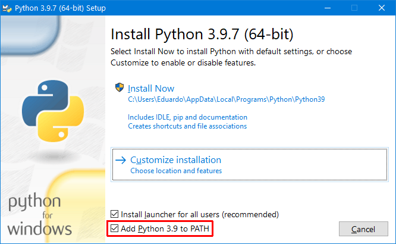

> ###### Ciência de Dados > Conteúdo > Ambiente de Desenvolvimento

# Python

Prof. Eduardo Ono

<br>

## Instalação do Python

### Windows

* Download

  * [https://www.python.org/downloads/](https://www.python.org/downloads/)

* Opções do instalador

  

### Ubuntu

* O comando a seguir verifica se o Python já está instalado. Tenta executar primeiro o comando `python --version`. Caso retorne um erro, tenta executar o comando `python3 --version`.

  ```sh
  python --version || python3 --version
  ```

* Para instalar o Python 3.x, caso já não esteja instalado:

  ```sh
  sudo apt update && sudo apt upgrade
  sudo apt install python3
  ```

* Para instalar o Python 2.x:

  ```sh
  sudo apt update && sudo apt upgrade
  sudo apt install python
  ```

* Para associar o comando `python3` ao comando `python`, principalmente no WSL 2:

  ```sh
  nano ~/.bash_profile
  ```

  Adicionar a linha no arquivo `.bash_profile`:

  ```sh
  alias python='/usr/bin/python3'
  ```

  Executar o comando:

  ```sh
  source ~/.bash_profile
  ```

  * https://www.how2shout.com/linux/how-to-install-python-3-and-pip-3-on-ubuntu-20-04-lts/

  * https://towardsdatascience.com/configuring-jupyter-notebook-in-windows-subsystem-linux-wsl2-c757893e9d69

  * https://davidbailey.codes/blog/2020-07-10-setting-up-jupyterlab-on-windows-10

  * https://www.digitalocean.com/community/tutorials/how-to-install-python-3-and-set-up-a-programming-environment-on-an-ubuntu-20-04-server-pt

  * https://websiteforstudents.com/how-to-install-python-on-ubuntu-linux/

  * https://linuxize.com/post/how-to-install-python-3-9-on-ubuntu-20-04/

  * https://computingforgeeks.com/how-to-install-python-on-ubuntu-linux-system/

<br>

## Python Pip

### Instalação do Pip no Windows

  Não é necessário pois faz parte da instalação "default" do Python 3.x para Windows.

### Instalação do Pip (Ubuntu)

```sh
sudo apt install python3-pip
```

### Listagem dos pacotes instalados

```sh
pip list
```

### Instalação de pacotes do Python utilizando o Pip

* Sintaxe do comando

  * pip install <packages-name>

* Exemplos

  * pip install numpy

  * Supondo o arquivo `requirements.txt` salvo no diretório, executar no mesmo diretório:

    ```sh
    pip install -r requirements.txt
    ```

    * Exemplo do conteúdo de um arquivo `requirements.txt`:

      ```txt
      pandas==0.25.3
      numpy==1.17.4
      ```

## Ambientes Virtuais

* https://docs.python-guide.org/dev/virtualenvs/#virtualenvironments-ref

* https://www.youtube.com/watch?v=z6_35nNKy0Y

<br>

---
https://github.com/eduardo-ono/Ciencia-de-Dados
