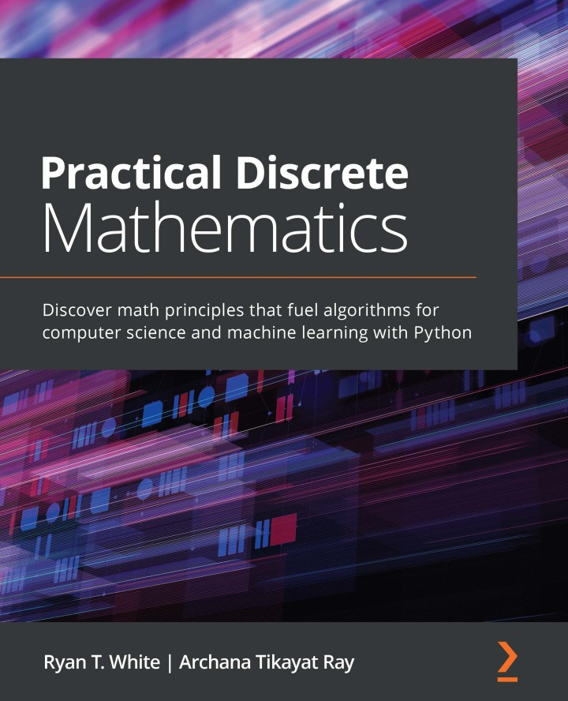

> <h5><a href="https://github.com/eduardo-ono/Ciencia-de-Dados">Ciência de Dados</a> > Conteúdo</h5>

# Matemática Discreta

Prof. Eduardo Ono

 

## Descrição

 

## Tópicos

* ### Overview

* ### Lógica Formal

* ### Teoria dos Conjuntos, Relações e Funções

* ### Sistemas de Numeração

* ### Princípio da Indução Finita

* ### Combinatória

* ### Probabilidade Discreta

 

## Bibliografia Básica

| Capa | Descrição|
| :-: | --- |
|  | [WHITE_2021] WHITE, Ryan T.; RAY, Archana Tikayat; <strong>Practical Discrete Mathematics</strong>, Birmingham: Packt Publishing, 2021.

 

### Vídeos de Apoio

| Thumb | Descrição |
| :-: | --- |
|  | [Internet Made Coder] [__How to Learn ALL THE MATHS YOU NEED for Programming/CS (Best Course Review)__](https://www.youtube.com/watch?v=bHZ627DJmLg) (8:18, YouTube, Jul/2022)
