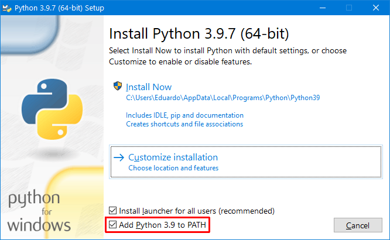

> <h5>Ciência de Dados > Conteúdo > Ambiente de Desenvolvimento</h5>

# Python

Prof. Eduardo Ono

<br>

## Instalação do Python

### Windows

* Link para download do instalador:

  * [https://www.python.org/downloads/](https://www.python.org/downloads/)

* Opções que devem ser marcadas durante a instalação:

  

### Linux/Ubuntu

* O comando a seguir verifica se o Python já está instalado. Tenta executar primeiro o comando `python --version`. Caso retorne um erro, tenta executar o comando `python3 --version`.

  ```sh
  python --version || python3 --version
  ```

* Para instalar o Python 3.x, caso já não esteja instalado:

  ```sh
  sudo apt update && sudo apt upgrade
  sudo apt install python3
  ```

  OBS.: Como o Python 2.x foi descontinuado, possivelmente no futuro, o comando de instalação será (atualmente instala a versão 2.x):

  ```sh
  sudo apt install python
  ```

* Para associar o comando `python3` ao comando `python`, principalmente no WSL 2, aAbrir para edição o arquivo `~/.bash_profile`:

  ```sh
  nano ~/.bash_profile
  ```

  Adicionar o comando a seguir no arquivo `.bash_profile`:

  ```sh
  alias python='/usr/bin/python3'
  ```

  Executar o comando a seguir ou reiniciar o terminal:

  ```sh
  source ~/.bash_profile
  ```

  * https://www.how2shout.com/linux/how-to-install-python-3-and-pip-3-on-ubuntu-20-04-lts/

  * https://towardsdatascience.com/configuring-jupyter-notebook-in-windows-subsystem-linux-wsl2-c757893e9d69

  * https://davidbailey.codes/blog/2020-07-10-setting-up-jupyterlab-on-windows-10

  * https://www.digitalocean.com/community/tutorials/how-to-install-python-3-and-set-up-a-programming-environment-on-an-ubuntu-20-04-server-pt

  * https://websiteforstudents.com/how-to-install-python-on-ubuntu-linux/

  * https://linuxize.com/post/how-to-install-python-3-9-on-ubuntu-20-04/

  * https://computingforgeeks.com/how-to-install-python-on-ubuntu-linux-system/

<br>


---
https://github.com/eduardo-ono/Ciencia-de-Dados

<br>

## Comandos Úteis para Gerenciamento do Python

* Exibir diretório de instalação do Python (Linux/Ubuntu):

```sh
which python
which python3
which python2
```

<br>

## Vídeos de Apoio

| Thumb | Descrição |
| :-: | --- |
| [](https://www.youtube.com/watch?v=8laFJI2l3gU) | <sup>[Ciência Programada]</sup> [__Criando um ambiente virtual para seu projeto Python__](https://www.youtube.com/watch?v=8laFJI2l3gU) <br> <sub>(1:18:40, YouTube, Ago/2020)</sub>

<br>
